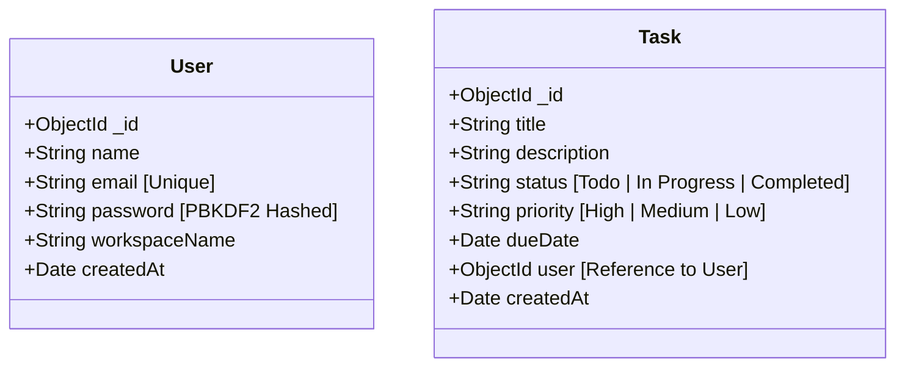

# TaskTracker — Premium Editorial Workspace

TaskTracker is a handcrafted, single-viewport developer workspace designed for builders who value clarity over clutter. It features a warm minimalist editorial design, native user authentication, dynamic SVG mask transitions, a slow-drifting tactile background, real-time activity feeds, and a spotlight command interface.

---

## Key Features

1. **Single-Viewport Layout (100vh)**: Fits entirely within one viewport on desktop. Absolutely no vertical or horizontal scrollbars. Every component adjusts dynamically to maximize density.
2. **Tactile Three.js Backdrop**: Drift layers representing slow-floating translucent paper sheets on a warm cream canvas, drawing inspiration from minimal Japanese graphic design.
3. **ProteinLens-Style SVG Transitions**: 
   - Swapping between Login and Sign Up cards fires an absolute wave mask sweep across the auth column, morphing components cleanly.
   - Submitting forms expands the action button into a fullscreen clip-path circle overlay that mounts the dashboard seamlessly.
4. **Self-Drawing SVG Hero**: Custom inline vector illustration that draws its outline, expands circular masks to reveal column grids, and floats task cards into place sequentially.
5. **Zero-Dependency Security Backend**: Native cryptography library PBKDF2 SHA-512 password hashers and custom HS256 JWT tokens. Avoids binary compilation compile errors during workspace setup.
6. **Multi-Tenant Isolation**: The task database schema links directly to user references, isolating boards, stats, and timelines strictly by account.
7. **Keystroke-Responsive Substring Search**: Case-insensitive regular expression query matches (`$regex`) matching partial search phrases instantly on typing, coupled with a 250ms input debouncer to prevent request queues.
8. **Curved Dropdowns**: Replaced native HTML select menus with custom React dropdown overlay components (`rounded-2xl` options card wrappers, `rounded-xl` hover choices) for a clean visual design.
9. **Recent Activity Feed**: Tracks and displays board activities (created, updated, completed, deleted, and restored tasks) dynamically.
10. **Humanized Relative Dates**: Parsed due date badges showing human expressions relative to today (e.g. `Due Today` in amber, `Tomorrow` in green, `Overdue by X days` in red).
11. **Undo Actions**: Delete action triggers a React Hot Toast notice containing an undo button to restore tasks optimistic.

---

## Folder Structure

```
TaskTracker/
├── client/
│   ├── src/
│   │   ├── components/    # Small UI component modules
│   │   │   ├── ActivityFeed.jsx
│   │   │   ├── CommandPalette.jsx
│   │   │   ├── CustomSelect.jsx      # Curved dropdown overlay
│   │   │   ├── DeleteModal.jsx
│   │   │   ├── EmptyState.jsx
│   │   │   ├── HeroIllustration.jsx  # Self-drawing animated SVG
│   │   │   ├── LoadingSkeleton.jsx
│   │   │   ├── MeshGradientBackground.jsx # Floating paper sheets
│   │   │   ├── SearchBar.jsx         # Debounced filters
│   │   │   ├── StatsDashboard.jsx    # Compact statistics
│   │   │   ├── TaskBoard.jsx         # Padding hover fixes
│   │   │   ├── TaskCard.jsx          # Mobile touch drag-and-drop
│   │   │   └── TaskDrawer.jsx        # Controller-bound dropdowns
│   │   ├── context/       
│   │   │   ├── AuthContext.jsx       # Delayed session state hook
│   │   │   └── TaskContext.jsx       
│   │   ├── hooks/         # useTasks, useCountUp custom hooks
│   │   ├── layouts/       # MainLayout.jsx structure
│   │   ├── pages/         
│   │   │   └── AuthPage.jsx          # Split viewport auth landing
│   │   ├── services/      # API axios interceptors
│   │   ├── utils/         # Relative due date helper
│   │   ├── index.css      # Editorial styling tokens
│   │   ├── App.jsx        # Route protection
│   │   └── main.jsx       
│   ├── package.json
│   └── ...
├── backend/
│   ├── config/            # Database connection handler
│   ├── controllers/       # Auth and Task controller hooks
│   ├── middleware/        # JWT verifications & errors
│   │   ├── authMiddleware.js
│   │   ├── errorHandler.js
│   │   └── rateLimiter.js
│   ├── models/            
│   │   ├── User.js        # Workspace schema
│   │   └── Task.js        # User references and indexes
│   ├── routes/            # Express route endpoints
│   ├── services/          # Task database query helpers
│   ├── utils/             # Password and JWT crypto helpers
│   │   ├── apiResponse.js
│   │   └── cryptoHelper.js
│   ├── validators/        # Express-validator schemas
│   ├── tests/             # Jest & supertest integration files
│   ├── server.js          
│   └── package.json
└── README.md
```

---

## Database Schema



---

## API Endpoints

### 🔑 Authentication Endpoints

| Method | Endpoint | Description | Payload Keys |
| :--- | :--- | :--- | :--- |
| **POST** | `/api/auth/register` | Create user workspace | `name`, `email`, `password`, `workspaceName` |
| **POST** | `/api/auth/login` | Log in to workspace | `email`, `password` |

### 📋 Task Endpoints (Protected)
*Requires header: `Authorization: Bearer <token>`*

| Method | Endpoint | Description | Query Parameters |
| :--- | :--- | :--- | :--- |
| **GET** | `/api/tasks` | Get all isolated tasks | `status`, `priority`, `search`, `sortBy`, `sortOrder` |
| **GET** | `/api/tasks/stats` | Count of isolated tasks | None |
| **GET** | `/api/tasks/:id` | Get single task | None |
| **POST** | `/api/tasks` | Create task | Form payload |
| **PUT** | `/api/tasks/:id` | Update task details | Form payload |
| **DELETE** | `/api/tasks/:id` | Remove task | None |

---

## Installation & Setup

### 1. Prerequisites
- Node.js (v18 or higher)
- MongoDB instance (Local community server or Atlas clusters)

### 2. Environment Configurations
Create `.env` inside `backend/`:
```env
PORT=5000
MONGO_URI=your_mongodb_connection_string
JWT_SECRET=your_secure_random_jwt_secret
CLIENT_URL=http://localhost:5173
NODE_ENV=development
```

### 3. Running Project Backend
1. Enter `backend/` directory.
2. Install dependencies: `npm install`.
3. Start development server: `npm run dev`.
4. Run integration test suite: `npm test`.

### 4. Running Project Client
1. Enter `client/` directory.
2. Install dependencies: `npm install`.
3. Start development server: `npm run dev`.
4. Navigate browser to: `http://localhost:5173`.
