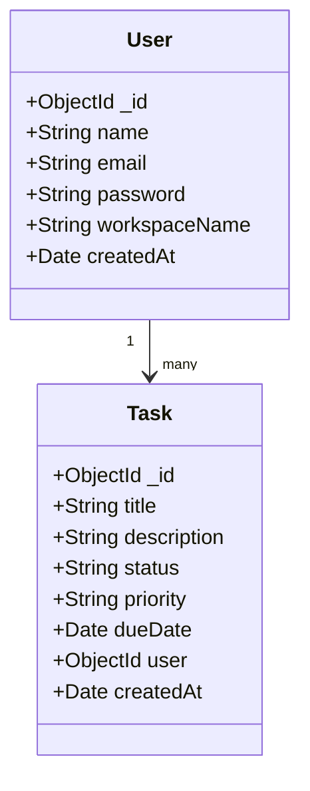

# TaskTracker

A personal task workspace I built because every other tool I tried was either too bloated or too ugly. TaskTracker fits entirely in one viewport, looks good doing it, and gets out of your way.

Built with React, Node.js, MongoDB, and a lot of stubbornness about the details.

---

## What it does

- **One screen, no scroll** — the entire dashboard lives within 100vh on desktop. No hidden panels, no sidebars that push things around.
- **Drag and drop on mobile** — touch-native card movement with a floating clone, ghost placeholder, and auto-scroll near screen edges. Zero re-renders during the drag so it actually feels smooth.
- **Real accounts** — register, log in, your tasks are yours only. Passwords hashed with PBKDF2 SHA-512, sessions signed with HS256 JWT. No third-party auth libraries.
- **Search that actually works** — type a partial word and it finds it. Regex-backed `$regex` queries on the backend, debounced 250ms on the frontend so it doesn't hammer the server on every keystroke.
- **Activity feed** — a running log of everything that happened on your board: created, updated, completed, deleted, restored.
- **Undo deletes** — accidentally trashed a task? There's a toast notification with an undo button. Click it within a few seconds and it comes back.
- **Human due dates** — instead of `2026-06-28`, cards show `Due Today`, `Tomorrow`, `In 3 days`, or `Overdue by 2 days` with color-coded badges.
- **Custom dropdowns** — the Status and Priority selectors are hand-built React components. No native `<select>` anywhere in sight.

---

## The design

Warm cream background, dark editorial type, a slow-drifting backdrop of translucent paper layers. The auth page has an SVG wave mask that sweeps across when you switch between login and signup. Submitting the form expands the button into a fullscreen circle that transitions into your dashboard.

There's also a self-drawing SVG on the landing page — it traces its own outline, reveals the column grid through an expanding circular mask, then floats the task cards in one by one.

---

## Folder structure

```
TaskTracker/
├── client/
│   └── src/
│       ├── components/
│       │   ├── ActivityFeed.jsx
│       │   ├── CommandPalette.jsx
│       │   ├── CustomSelect.jsx          # hand-rolled dropdown
│       │   ├── DeleteModal.jsx
│       │   ├── EmptyState.jsx
│       │   ├── HeroIllustration.jsx      # self-drawing SVG
│       │   ├── LoadingSkeleton.jsx
│       │   ├── MeshGradientBackground.jsx
│       │   ├── SearchBar.jsx
│       │   ├── StatsDashboard.jsx
│       │   ├── TaskBoard.jsx
│       │   ├── TaskCard.jsx              # mobile touch drag
│       │   └── TaskDrawer.jsx
│       ├── context/
│       │   ├── AuthContext.jsx
│       │   └── TaskContext.jsx
│       ├── hooks/
│       ├── layouts/
│       ├── pages/
│       │   └── AuthPage.jsx
│       ├── services/
│       └── utils/
├── backend/
│   ├── config/
│   ├── controllers/
│   ├── middleware/
│   │   ├── authMiddleware.js
│   │   ├── errorHandler.js
│   │   └── rateLimiter.js
│   ├── models/
│   │   ├── User.js
│   │   └── Task.js
│   ├── routes/
│   ├── services/
│   ├── utils/
│   │   ├── apiResponse.js
│   │   └── cryptoHelper.js              # PBKDF2 + JWT, no libraries
│   ├── validators/
│   ├── tests/
│   └── server.js
└── README.md
```

---

## Data models



---

## API

### Auth

| Method | Route | What it does |
| --- | --- | --- |
| POST | `/api/auth/register` | Create a new account |
| POST | `/api/auth/login` | Get a session token |

### Tasks (need `Authorization: Bearer <token>`)

| Method | Route | What it does |
| --- | --- | --- |
| GET | `/api/tasks` | Fetch tasks — filterable by status, priority, search, sort |
| GET | `/api/tasks/stats` | Counts by status |
| GET | `/api/tasks/:id` | Single task |
| POST | `/api/tasks` | Create task |
| PUT | `/api/tasks/:id` | Update task |
| DELETE | `/api/tasks/:id` | Delete task |

---

## Running locally

You need Node.js v18+ and a MongoDB instance (local or Atlas).

**Backend**

Create `backend/.env`:
```env
PORT=5000
MONGO_URI=your_mongodb_connection_string
JWT_SECRET=pick_something_long_and_random
CLIENT_URL=http://localhost:5173
NODE_ENV=development
```

```bash
cd backend
npm install
npm run dev
```

To run the test suite:
```bash
npm test
```

**Frontend**

```bash
cd client
npm install
npm run dev
```

Open `http://localhost:5173`.

---

## Deployed

- Frontend: [tasktracker-aman.netlify.app](https://tasktracker-aman.netlify.app)
- Backend: [tasktracker-fakr.onrender.com](https://tasktracker-fakr.onrender.com)
